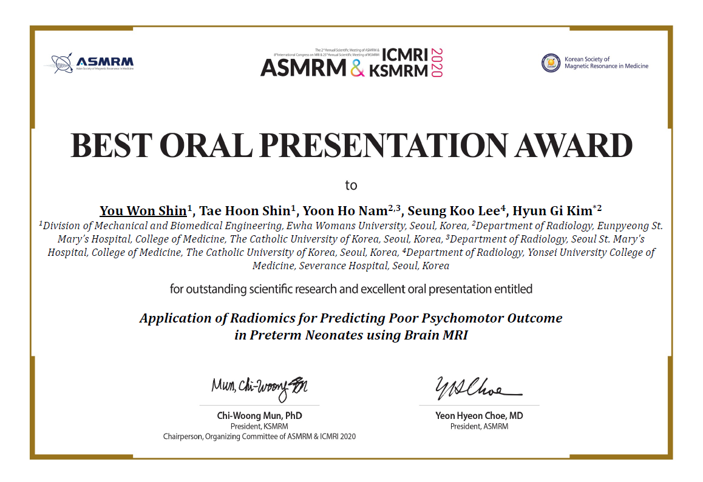
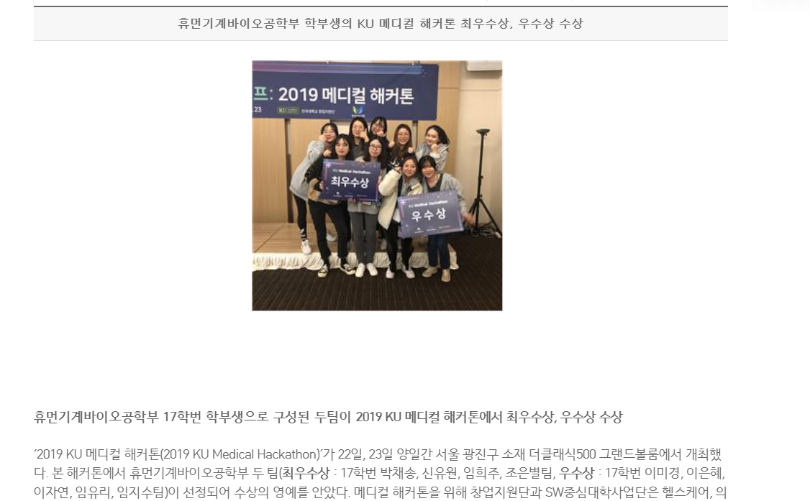

<h1><b>Certifications</b></h1>

<h2>Computer Certificates</h2>

	

		<i>정보처리기사</i>
	

	

		<i>&nbsp;&nbsp; 31, Dec 2020</i>
	

	<li style="margin-left: 40px">
		Engineer Information Processing</li>
	<li style="margin-left: 40px">
		Issued by Human Resources Development Service of Korea</li>

	

		<i>데이터분석 준전문가</i>
	

	

		<i>&nbsp;&nbsp; 07, Jul 2020</i>
	

	<li style="margin-left: 40px">
		ADsP: Advanced Data Analytics Semi-Professional</li>
	<li style="margin-left: 40px">
		Issued by Korea Data Agency</li>

	

		<i>SQL 개발자</i>
	

	

		<i>&nbsp;&nbsp; 30, Jun 2020</i>
	

	<li style="margin-left: 40px">
		SQLD: SQL Developer</li>
	<li style="margin-left: 40px">
		Issued by Korea Data Agency</li>

<h2>English Certificates</h2>
	

		

			<i>TOEIC</i>
		

		

			<i>&nbsp;&nbsp; 21, Feb 2021</i>
		

		<li style="margin-left: 40px">
			<big><b>970</b></big>&nbsp;(LC: 495 / RC: 475)</li>
		<li style="margin-left: 40px">
			Issued by YBM</li>
	

	

		

			<i>OPIC</i>
		

		

			<i>&nbsp;&nbsp; 04, May 2020</i>
		

		<li style="margin-left: 40px; ">
			<big><b>Intermediate High</b></big></li>
		<li style="margin-left: 40px">
			Issued by ACTFL</li>
	

     

<h1><b>Prizes</b></h1>

	

		<i>Best Trainee Oral Presentation Award</i>
	

	

		<i>&nbsp;&nbsp; 13, Nov 2020</i>
	

	<li style="margin-left: 40px">
		Excellent presentation in academic conference</li>
	<li style="margin-left: 40px">
		Issued by ASMRM&ICMRI</li>
	

	

		<i>The Grand Prize</i>
	

	

		<i>&nbsp;&nbsp; 23, Nov 2019</i>
	

	<li style="margin-left: 40px">
		Proposed AI psychological analysis system</li>
	<li style="margin-left: 40px">
		Issued by Konkuk University/Konkuk University Medical Center</li>
	

