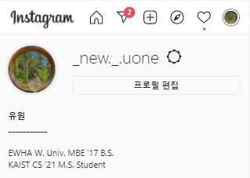
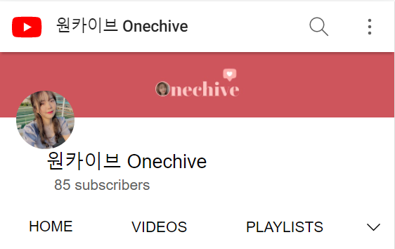

	<h4>Let me introduce my other private spaces! 
	I am using SNS very actively to express myself and record my memories. 
	 If you're interested, you can take a look around :)
	</h4>

	

		

			<i>Instagram</i>
		
 
		

			<i>&nbsp;&nbsp;@_new._.uone</i>
		

	

	

		
		

			 
			This is a precious space that contains all my daily lives and travel records from my first year of college.
		

	

	

		

			<i>Youtube</i>
		
 
		

			<i>&nbsp;&nbsp;원카이브 [Onechive]</i>
		

	

	

		
		

			 
			After entering graduate school, I started YouTube to record my daily life on video. I hope I can reminisce about my past through these videos, and also I hope other people can enjoy my memories with me.
		

	

